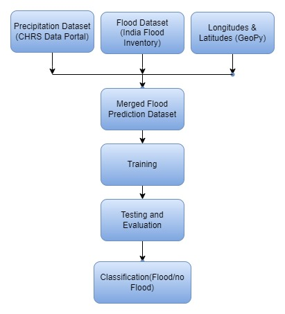
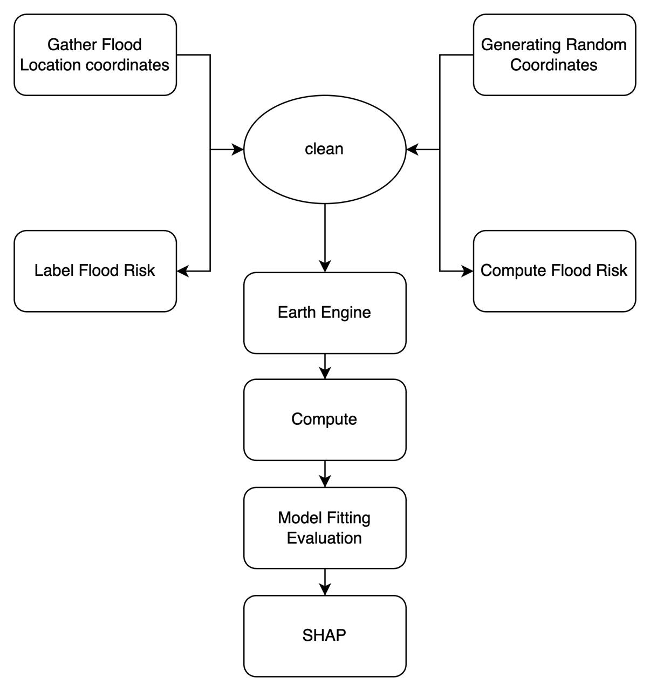
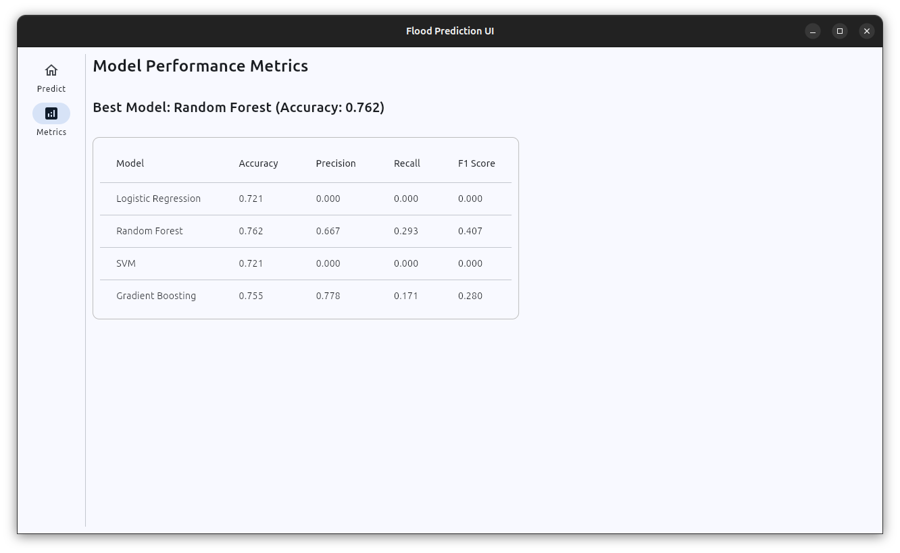
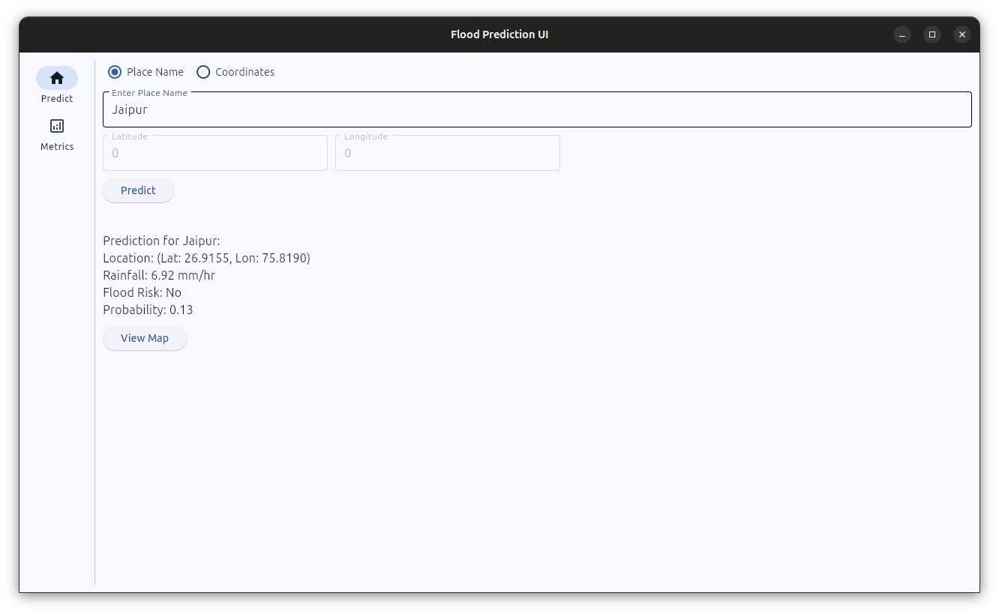
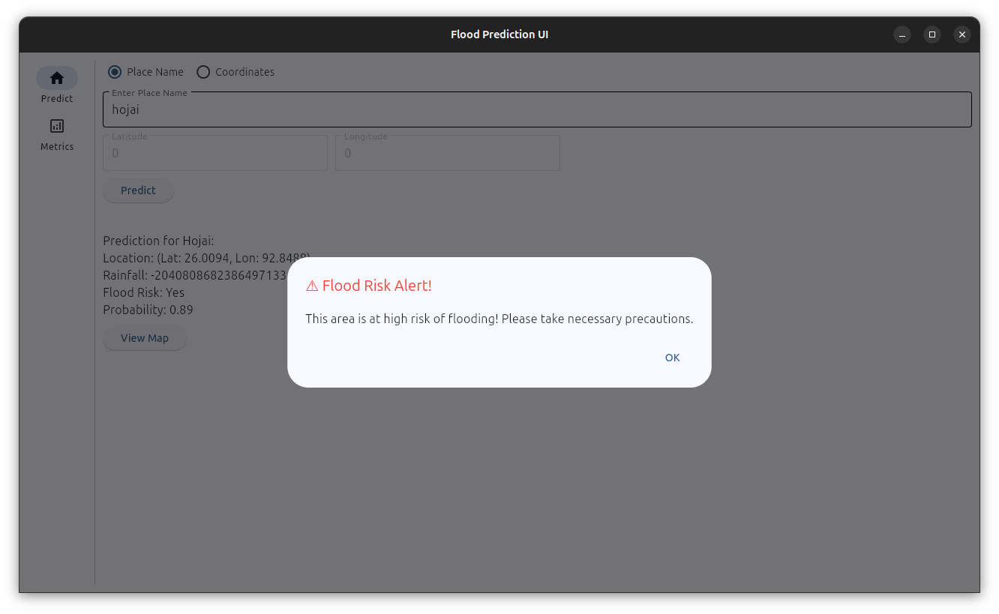
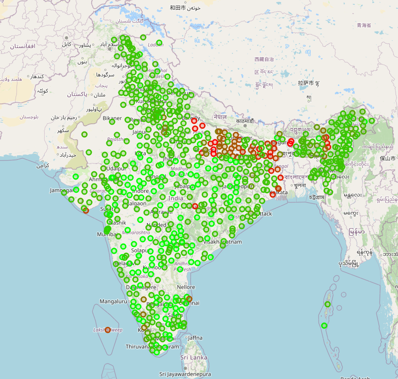
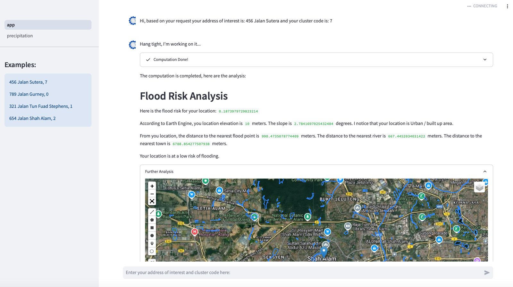

# Team-Ace

**Problem Statement:**  
Create a model that identifies patterns or risk factors that indicate the onset of Floods using satellite imagery and relevant data that helps predict natural disasters.   

**Abstract Solution:**  
This project aims to develop a predictive model for identifying flood-prone areas by integrating flood occurrence data with precipitation patterns and geographical information (longitude, latitude) to create a merged dataset. The goal is to build a model that classifies regions based on flood risk. Additionally, we incorporate Digital Elevation Model (DEM) analysis using raster images to obtain elevation maps, which adds another dimension to understanding flood risks in low-lying areas.   

**Our Approaches**  

**Interface**  
Approach 1: 

Approach 2:

